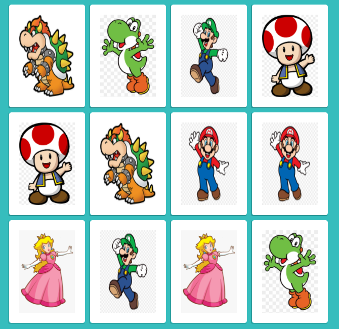

# **Desenvolvendo um jogo de memória**

## Projeto do Bootcamp JavaScript Game Developer na plataforma [Digital Innovation One](https://digitalinnovation.one/sign-up)

### Ministrado por: [Gabriela Pinheiro](https://www.linkedin.com/in/gabrielapinheiro129/)

### **Objetivo**
Criar um jogo da memória utilizando apenas linguagem HTML5, CSS3 e Javascript.

### **Conceitos Abordados**
- Efeitos 3D no CSS3.
- Lógica de programação utilizando condicionais no JS.
- Immediately Invoked Function Expression no JS.
- Manipulação de Array no JS.

### **Tecnologias Utilizadas**
- Visual Studio Code:
    - Live Server.
- Navegador.

### **Resultado Final**
